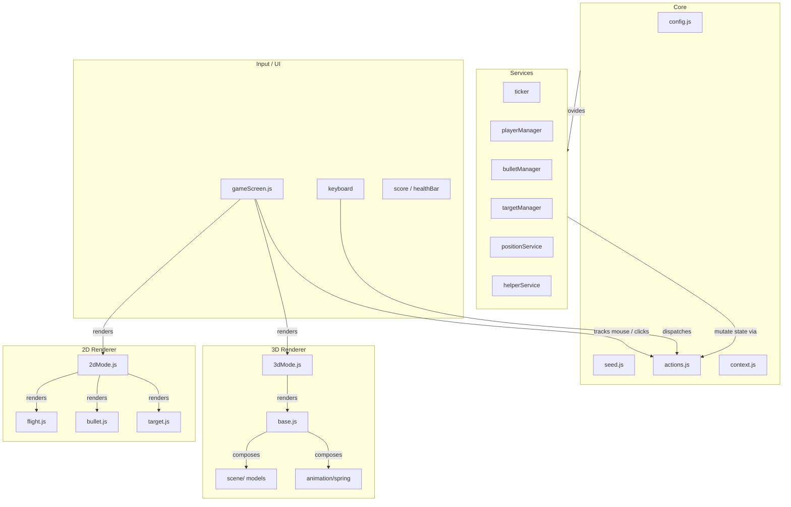
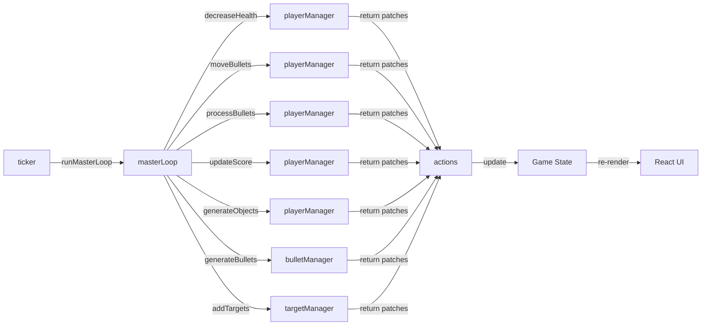
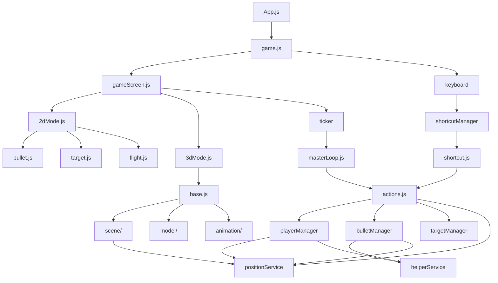

# Table of Contents

- [Overview](#overview)
  - [Game Concepts](#game-concepts)
  - [Key Files](#key-files)
- [Architecture](#architecture)
  - [Components](#components)
  - [Diagrams](#diagrams)
    - [1. Component Overview](#1-component-overview)
    - [2. Game Loop Data Flow](#2-game-loop-data-flow)
    - [3. Rendering Mode Flow](#3-rendering-mode-flow)
    - [4. Dependency Graph](#4-dependency-graph)

---

# Overview

Simple Game is a vertical scrolling shooter built with React. The player controls a fighter jet at the bottom of the screen, shoots enemy targets descending from above, dodges return fire, and collects power-ups (like double-bullets). The game supports both 2D (CSS/DOM) and 3D (Three.js via React Three Fiber) rendering modes toggled by a URL query parameter.

## Game Concepts

- **Player**: A fighter jet that follows the mouse horizontally. Clicking fires bullets upward.
- **Enemies**: Two types of targets (`shooter`, `firingShooter`) spawn at the top and move down.
- **Bullets**: Fired by both player and enemies. Different types (normal, super) deal different damage.
- **Power-ups**: Collectible items like `doubleBullet` that temporarily increase fire rate.
- **Health & Score**: Player health decreases on enemy hit or over time. Score increases when targets are destroyed.
- **2D Mode**: Renders elements as CSS-positioned DOM nodes using percentage/viewport units.
- **3D Mode**: Renders elements in a WebGL canvas using GLTF models, spring animations, and positional audio.

## Key Files

| Path | Purpose |
|------|---------|
| `src/core/config.js` | All game constants: speeds, sizes, probabilities, images, audio settings |
| `src/core/seed.js` | Initial game state object |
| `src/core/actions.js` | All state-mutation action definitions |
| `src/services/ticker/masterLoop.js` | Ordered list of actions run each game tick |
| `src/services/playerManager.js` | Core gameplay logic: collisions, scoring, health, movement |
| `src/services/bulletManager.js` | Player and enemy bullet generation |
| `src/services/targetManager.js` | Enemy target spawning logic |
| `src/components/gameScreen.js` | Main screen: handles mouse events, starts ticker, selects renderer mode |
| `src/components/2dMode/2dMode.js` | 2D DOM renderer composition |
| `src/components/3dMode/3dMode.js` | 3D WebGL renderer entry via R3F `<Canvas>` |

---

# Architecture

## Components

| Component | Description |
|-----------|-------------|
| **Core** | Central configuration, initial game state (seed), and state-mutation action definitions. |
| **Services** | Game engine services: game loop ticker, collision/position math, bullet/target generators, player state manager, and input helpers. |
| **2D Renderer** | DOM-based rendering layer using React components styled with CSS/SCSS. |
| **3D Renderer** | WebGL-based rendering layer using `@react-three/fiber` and `@react-three/drei` with GLTF models and spring animations. |
| **Input / UI** | Mouse tracking, keyboard shortcuts, welcome/game-over screens, health bar, score, audio controls, and help overlay. |
| **Assets** | 3D models, audio clips, images, and fonts served from the public folder. |

## Diagrams

### 1. Component Overview

Main layers and how they interact during gameplay.



### 2. Game Loop Data Flow

How state evolves each tick of the master loop.



### 3. Rendering Mode Flow

How the same game state is projected into 2D or 3D.

```mermaid
flowchart TD
    User[Player] -->|mouse / click / key| GameScreen[gameScreen.js]
    GameScreen -->|reads ?mode=| URL[urlService]
    URL -->|2d| TwoD[2dMode]
    URL -->|3d| ThreeD[3dMode]
    TwoD -->|CSS positioning| DOM[DOM Elements]
    ThreeD -->|<Canvas>| R3F[@react-three/fiber]
    R3F -->|GLTF models + lights| WebGL[WebGL Scene]
    GameScreen -->|tick| Ticker[ticker / masterLoop]
    Ticker -->|mutates| State[(Shared Game State)]
    State -->|feeds| TwoD
    State -->|feeds| ThreeD
```

### 4. Dependency Graph

Key internal module dependencies.


